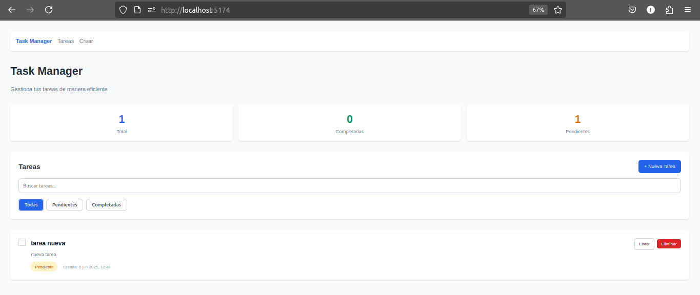
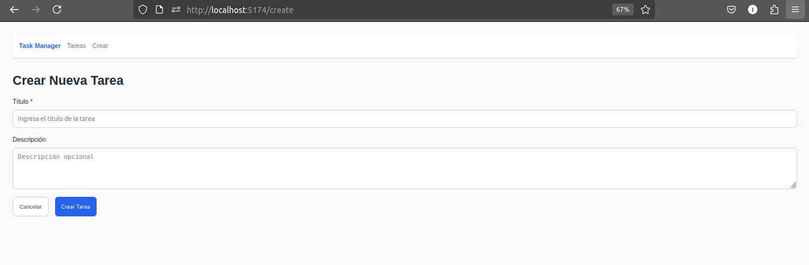
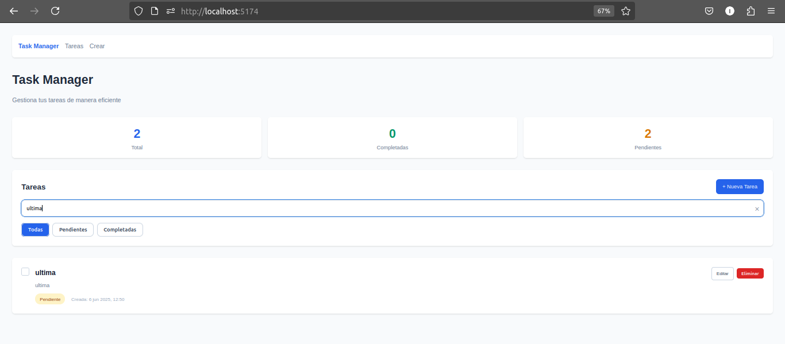
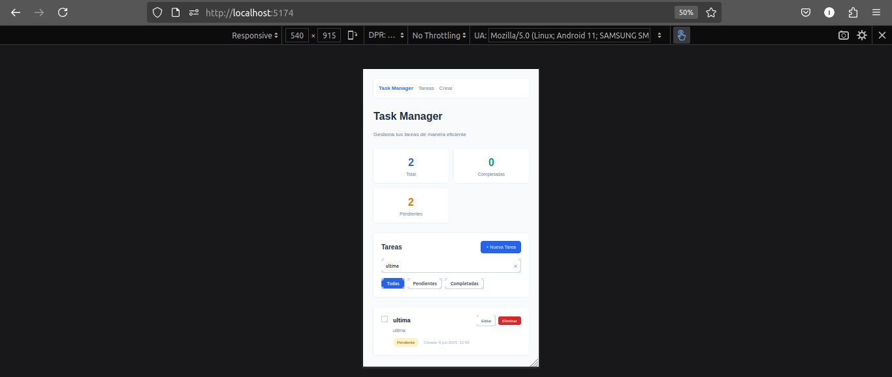

# Task Manager

App de gestión de tareas con React y Express.

## Capturas







## Cómo ejecutarlo

### Solo frontend (recomendado)

```bash
git clone <repository-url>
cd academiaForIT/frontend
npm install
npm run dev
```

Abre `http://localhost:5174`

### Con backend

**Terminal 1:**
```bash
cd backend
npm install
npm run dev
```

**Terminal 2:**
```bash
cd frontend
npm install
npm run dev
```
