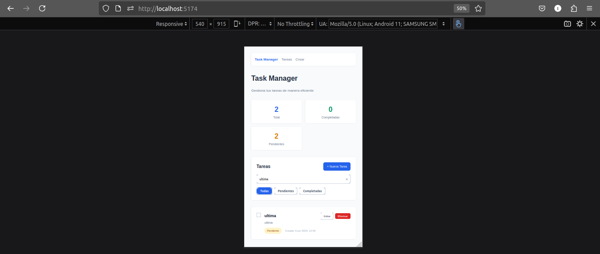

# Task Manager Frontend

El frontend de la app de tareas hecho con React. Usa Vite para desarrollo y CSS puro sin frameworks.

## Screenshots




## Qué incluye

**Lo básico:**
- Crear, editar, borrar tareas
- Marcar como completadas
- Funciona en móvil y desktop
- Se actualiza al instante

**Extra:**
- Búsqueda en tiempo real
- Filtros por estado
- Validación de formularios
- Estadísticas básicas
- CSS puro (sin Bootstrap ni nada)
- Navegación fluida con React Router

## Tecnologías

- React 19
- Vite para desarrollo
- React Router para navegación
- CSS puro con flexbox/grid
- Hooks de React para el estado

## Project Structure

```
src/
├── components/          # Reusable UI components
│   ├── Layout.jsx      # Main layout wrapper
│   ├── TaskList.jsx    # Task list with search and filters
│   ├── TaskItem.jsx    # Individual task component
│   ├── TaskForm.jsx    # Form for creating/editing tasks
│   ├── SearchBar.jsx   # Search input component
│   └── FilterButtons.jsx # Filter buttons component
├── pages/              # Page components
│   ├── Home.jsx        # Main tasks page
│   ├── CreateTask.jsx  # Create new task page
│   ├── EditTask.jsx    # Edit existing task page
│   └── TaskDetail.jsx  # Task detail view page
├── hooks/              # Custom React hooks
│   └── useTasks.js     # Task management hook
├── services/           # API service layer
│   └── api.js          # API client
└── main.jsx           # Application entry point
```

## Cómo ejecutarlo

**Necesitas:**
- Node.js v16 o más nuevo
- npm o yarn

**Pasos:**

1. Clona el repo y ve a la carpeta frontend
```bash
git clone <repository-url>
cd task-manager/frontend
```

2. Instala dependencias
```bash
npm install
```

3. Ejecuta el servidor de desarrollo
```bash
npm run dev
```

4. Abre el navegador en `http://localhost:5174`

Ya está. Viene con datos de ejemplo para que puedas probar todo sin configurar nada más.

**Con yarn o pnpm:**
```bash
yarn install && yarn dev
# o
pnpm install && pnpm dev
```

**Para producción:**
```bash
npm run build
npm run preview  # para ver el build
```

**Si algo no funciona:**
- Puerto ocupado: Vite usa automáticamente otro puerto
- Problemas con Node: necesitas v16+
- Cache raro: `npm run dev -- --force`
- Dependencias: borra `node_modules` y reinstala

## Estructura

```
frontend/
├── src/
│   ├── App.jsx      # Todo el código de la app
│   ├── main.jsx     # Punto de entrada
│   └── index.css    # Estilos
├── index.html
├── package.json
└── vite.config.js
```

## Comandos

- `npm run dev` - Servidor de desarrollo
- `npm run build` - Compilar para producción
- `npm run preview` - Ver el build compilado
- `npm run lint` - Revisar código

## Qué hace la app

**Básico:**
- CRUD de tareas
- Marcar completadas/pendientes
- Se actualiza al instante

**Extra:**
- Búsqueda en tiempo real
- Filtros por estado
- Estadísticas básicas
- Validación de formularios
- Responsive design
- Navegación SPA

## API Integration

The frontend communicates with the backend API using the following endpoints:

- `GET /api/tasks` - Fetch all tasks (with optional search query)
- `GET /api/tasks/:id` - Fetch single task
- `POST /api/tasks` - Create new task
- `PUT /api/tasks/:id` - Update existing task
- `DELETE /api/tasks/:id` - Delete task
- `GET /api/tasks/stats` - Get task statistics

## Features in Detail

### Search Functionality
- Real-time search through task titles and descriptions
- Clear search button for easy reset
- Search persists across page navigation

### Filter System
- Filter by task status: All, Pending, Completed
- Visual indicators for active filters
- Combines with search functionality

### Form Validation
- Required field validation
- Real-time error display
- Prevents submission of invalid data
- User-friendly error messages

### Task Statistics
- Total tasks count
- Completed tasks count
- Pending tasks count
- Visual dashboard with color-coded metrics

### Responsive Design
- Mobile-first approach
- Adaptive layouts for different screen sizes
- Touch-friendly interface elements
- Optimized for both desktop and mobile use

## Code Quality

- **ESLint**: Code linting with React-specific rules
- **Component Architecture**: Modular, reusable components
- **Custom Hooks**: Separation of concerns with custom hooks
- **Error Handling**: Comprehensive error handling throughout the app
- **Loading States**: User feedback during async operations

## Browser Support

- Chrome (latest)
- Firefox (latest)
- Safari (latest)
- Edge (latest)

## Development Notes

### Code Style
- Clean, comment-free code for production readiness
- Descriptive variable and function names
- Consistent formatting and indentation
- Modern ES6+ JavaScript features

### Performance Optimizations
- Efficient state management with React hooks
- Optimized re-renders with proper dependency arrays
- Lightweight CSS without external frameworks
- Fast development server with Vite

### Browser Compatibility
- Modern browsers (Chrome, Firefox, Safari, Edge)
- ES6+ features supported
- CSS Grid and Flexbox for layouts
- Responsive design for all screen sizes

## Deployment

### Static Hosting (Recommended)
This is a client-side application that can be deployed to any static hosting service:

- **Vercel**: `vercel --prod`
- **Netlify**: Drag and drop the `dist` folder
- **GitHub Pages**: Push the `dist` folder to `gh-pages` branch
- **Firebase Hosting**: `firebase deploy`

### Build Process
```bash
npm run build
```
This creates a `dist` folder with optimized production files.

## Screenshots

Las capturas están en `../screenshots/`. Si quieres actualizarlas:

1. Ejecuta la app: `npm run dev`
2. Toma screenshots en buena calidad (PNG)
3. Guárdalas con los nombres que están en `../screenshots/README.md`
4. Incluye vista móvil usando DevTools del navegador

## Contribuir

Si quieres mejorar algo:

1. Haz fork
2. Crea una rama para tu feature
3. Haz tus cambios (sin comentarios en el código)
4. Actualiza screenshots si cambias la UI
5. Haz commit y pull request

### Development Guidelines
- Keep components simple and focused
- Use inline styles for component-specific styling
- Maintain the existing file structure
- Test all CRUD operations after changes
- Ensure responsive design works on all devices

## Support

If you encounter any issues:

1. Check the troubleshooting section above
2. Verify Node.js version compatibility
3. Clear browser cache and restart dev server
4. Check browser console for error messages

## License

This project is open source and available under the MIT License.
