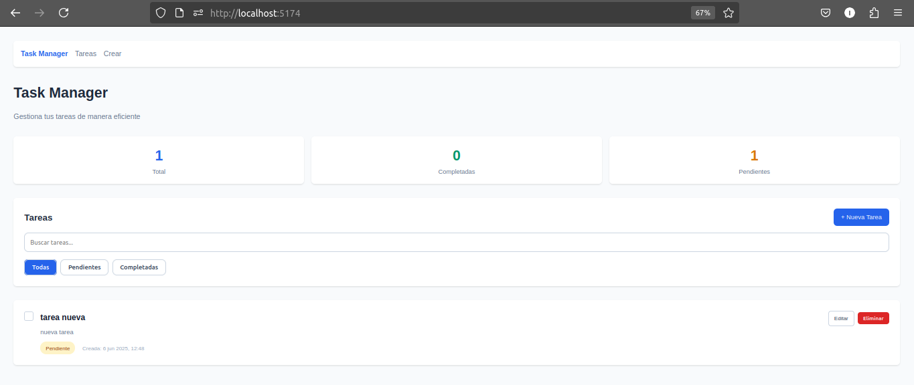
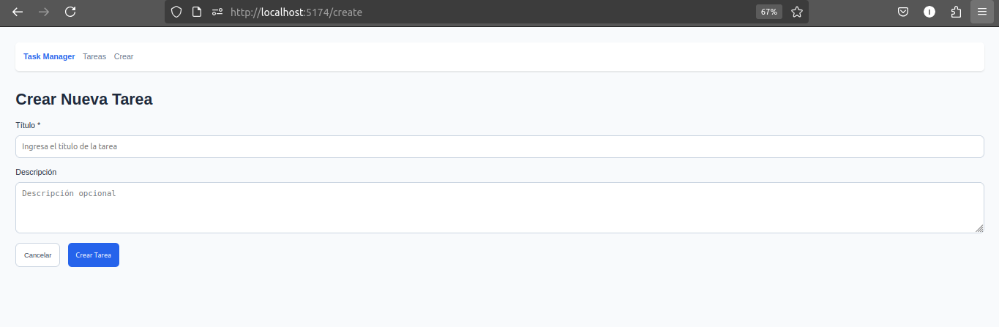

# Task Manager Frontend

A modern React frontend for the Task Manager application built with Vite, React Router, and elegant custom CSS.

## 📸 Screenshots

### Main Dashboard

*Complete task management interface with statistics, search, and filters*

### Task Creation Form

*Clean form design with validation and user-friendly interface*

### Task Detail View

*Detailed view of individual tasks with edit and delete options*

### Search & Filter Functionality

*Real-time search and intelligent filtering system*

### Mobile Responsive Design

*Fully responsive design optimized for mobile devices*

### Task States & Interactions

*Visual representation of completed vs pending tasks*

## Features

### Core Functionality
- ✅ **CRUD Operations**: Create, read, update, and delete tasks
- ✅ **Task Management**: Mark tasks as completed/pending
- ✅ **Responsive Design**: Works on desktop and mobile devices
- ✅ **Real-time Updates**: Immediate UI updates after operations

### Bonus Features
- 🔍 **Search Functionality**: Search tasks by title and description
- 🔽 **Filter Options**: Filter tasks by status (All, Pending, Completed)
- ✅ **Form Validation**: Client-side validation with error messages
- 📊 **Task Statistics**: Dashboard showing total, completed, and pending tasks
- 🎨 **Modern UI**: Clean design with elegant custom CSS
- 🚀 **Fast Navigation**: React Router for smooth page transitions

## Tech Stack

- **React 19** - Frontend framework
- **Vite** - Build tool and dev server
- **React Router DOM** - Client-side routing
- **Custom CSS** - Elegant, modern styling with CSS variables and flexbox/grid
- **Custom Hooks** - Reusable state management
- **Fetch API** - HTTP client for API calls

## Project Structure

```
src/
├── components/          # Reusable UI components
│   ├── Layout.jsx      # Main layout wrapper
│   ├── TaskList.jsx    # Task list with search and filters
│   ├── TaskItem.jsx    # Individual task component
│   ├── TaskForm.jsx    # Form for creating/editing tasks
│   ├── SearchBar.jsx   # Search input component
│   └── FilterButtons.jsx # Filter buttons component
├── pages/              # Page components
│   ├── Home.jsx        # Main tasks page
│   ├── CreateTask.jsx  # Create new task page
│   ├── EditTask.jsx    # Edit existing task page
│   └── TaskDetail.jsx  # Task detail view page
├── hooks/              # Custom React hooks
│   └── useTasks.js     # Task management hook
├── services/           # API service layer
│   └── api.js          # API client
└── main.jsx           # Application entry point
```

## Getting Started

### Prerequisites
- Node.js (v16 or higher)
- npm or yarn package manager
- Git (for cloning the repository)

### Quick Start - Running Locally

Follow these steps to run the Task Manager application on your local machine:

#### 1. Clone the Repository
```bash
git clone <repository-url>
cd task-manager
```

#### 2. Navigate to Frontend Directory
```bash
cd frontend
```

#### 3. Install Dependencies
```bash
npm install
```

#### 4. Start the Development Server
```bash
npm run dev
```

#### 5. Open in Browser
The application will automatically start and be available at:
- **Local**: `http://localhost:5174` (or `http://localhost:5173`)
- The exact port will be displayed in your terminal

#### 6. Start Using the App
Once the application loads, you can:
- ✅ View the pre-loaded sample tasks
- 🔍 Search tasks using the search bar
- 🔽 Filter tasks by status (All, Pending, Completed)
- ➕ Create new tasks by clicking "Nueva Tarea"
- ✏️ Edit existing tasks by clicking "Editar"
- 👁️ View task details by clicking on task titles
- ✅ Mark tasks as completed by clicking the checkbox
- 🗑️ Delete tasks using the "Eliminar" button

### Alternative Installation Methods

#### Using Yarn
```bash
yarn install
yarn dev
```

#### Using pnpm
```bash
pnpm install
pnpm dev
```

### Environment Configuration (Optional)

If you plan to connect to a backend API later:

1. Create environment file:
```bash
cp .env.example .env
```

2. Update environment variables in `.env`:
```
VITE_API_URL=http://localhost:3000
```

### Build for Production

```bash
npm run build
```

### Preview Production Build

```bash
npm run preview
```

### Troubleshooting

#### Port Already in Use
If port 5173 is already in use, Vite will automatically try the next available port (5174, 5175, etc.). Check your terminal output for the correct URL.

#### Node.js Version Issues
Make sure you're using Node.js v16 or higher:
```bash
node --version
```

#### Clear Cache (if needed)
```bash
npm run dev -- --force
```

#### Dependencies Issues
Delete node_modules and reinstall:
```bash
rm -rf node_modules package-lock.json
npm install
```

## Project Structure

```
frontend/
├── public/                 # Static assets
├── src/
│   ├── App.jsx            # Main application component with all functionality
│   ├── main.jsx           # Application entry point
│   └── index.css          # Global styles and CSS utilities
├── index.html             # HTML template
├── package.json           # Dependencies and scripts
├── vite.config.js         # Vite configuration
└── README.md              # This file
```

## Available Scripts

- `npm run dev` - Start development server with hot reload
- `npm run build` - Build for production
- `npm run preview` - Preview production build locally
- `npm run lint` - Run ESLint for code quality

## Features Overview

### Core Functionality
- ✅ **CRUD Operations**: Create, Read, Update, Delete tasks
- ✅ **Task Status**: Mark tasks as completed or pending
- ✅ **Real-time Updates**: Instant UI updates without page refresh

### Enhanced Features
- 🔍 **Search**: Real-time search through task titles and descriptions
- 🔽 **Filters**: Filter by All, Pending, or Completed tasks
- 📊 **Statistics**: Live dashboard showing task counts
- ✅ **Form Validation**: Required field validation with error messages

### User Experience
- 📱 **Responsive Design**: Works on desktop, tablet, and mobile
- 🎨 **Modern UI**: Clean, elegant design with smooth transitions
- ⚡ **Fast Performance**: Optimized React components
- 🚀 **Single Page App**: Smooth navigation without page reloads

## Technology Stack

- **Frontend Framework**: React 19
- **Build Tool**: Vite
- **Routing**: React Router DOM
- **Styling**: Custom CSS (no external frameworks)
- **State Management**: React Hooks (useState, useEffect)
- **Development**: Hot Module Replacement (HMR)

## API Integration

The frontend communicates with the backend API using the following endpoints:

- `GET /api/tasks` - Fetch all tasks (with optional search query)
- `GET /api/tasks/:id` - Fetch single task
- `POST /api/tasks` - Create new task
- `PUT /api/tasks/:id` - Update existing task
- `DELETE /api/tasks/:id` - Delete task
- `GET /api/tasks/stats` - Get task statistics

## Features in Detail

### Search Functionality
- Real-time search through task titles and descriptions
- Clear search button for easy reset
- Search persists across page navigation

### Filter System
- Filter by task status: All, Pending, Completed
- Visual indicators for active filters
- Combines with search functionality

### Form Validation
- Required field validation
- Real-time error display
- Prevents submission of invalid data
- User-friendly error messages

### Task Statistics
- Total tasks count
- Completed tasks count
- Pending tasks count
- Visual dashboard with color-coded metrics

### Responsive Design
- Mobile-first approach
- Adaptive layouts for different screen sizes
- Touch-friendly interface elements
- Optimized for both desktop and mobile use

## Code Quality

- **ESLint**: Code linting with React-specific rules
- **Component Architecture**: Modular, reusable components
- **Custom Hooks**: Separation of concerns with custom hooks
- **Error Handling**: Comprehensive error handling throughout the app
- **Loading States**: User feedback during async operations

## Browser Support

- Chrome (latest)
- Firefox (latest)
- Safari (latest)
- Edge (latest)

## Development Notes

### Code Style
- Clean, comment-free code for production readiness
- Descriptive variable and function names
- Consistent formatting and indentation
- Modern ES6+ JavaScript features

### Performance Optimizations
- Efficient state management with React hooks
- Optimized re-renders with proper dependency arrays
- Lightweight CSS without external frameworks
- Fast development server with Vite

### Browser Compatibility
- Modern browsers (Chrome, Firefox, Safari, Edge)
- ES6+ features supported
- CSS Grid and Flexbox for layouts
- Responsive design for all screen sizes

## Deployment

### Static Hosting (Recommended)
This is a client-side application that can be deployed to any static hosting service:

- **Vercel**: `vercel --prod`
- **Netlify**: Drag and drop the `dist` folder
- **GitHub Pages**: Push the `dist` folder to `gh-pages` branch
- **Firebase Hosting**: `firebase deploy`

### Build Process
```bash
npm run build
```
This creates a `dist` folder with optimized production files.

## 📸 Screenshots

Screenshots are located in the `../screenshots/` directory. To update or add new ones:

1. **Run the application**: `npm run dev`
2. **Follow the guide**: See `../screenshots/README.md` for detailed specifications
3. **Required screenshots**:
   - Dashboard view with all features visible
   - Task creation form
   - Task detail page
   - Search and filter functionality
   - Mobile responsive view
   - Different task states

4. **Technical specs**:
   - Resolution: 1920x1080 or higher
   - Format: PNG for UI screenshots
   - Size: Maximum 2MB per image
   - Mobile: Use browser DevTools simulation

## Contributing

1. Fork the repository
2. Create a feature branch: `git checkout -b feature-name`
3. Follow the existing code style (no comments in code)
4. Test your changes thoroughly
5. Update screenshots if UI changes are made
6. Commit with clear messages: `git commit -m "Add feature description"`
7. Push to your branch: `git push origin feature-name`
8. Create a Pull Request

### Development Guidelines
- Keep components simple and focused
- Use inline styles for component-specific styling
- Maintain the existing file structure
- Test all CRUD operations after changes
- Ensure responsive design works on all devices

## Support

If you encounter any issues:

1. Check the troubleshooting section above
2. Verify Node.js version compatibility
3. Clear browser cache and restart dev server
4. Check browser console for error messages

## License

This project is open source and available under the MIT License.
